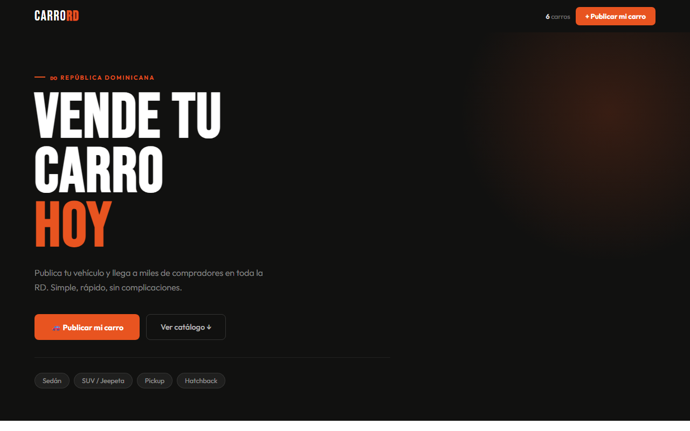
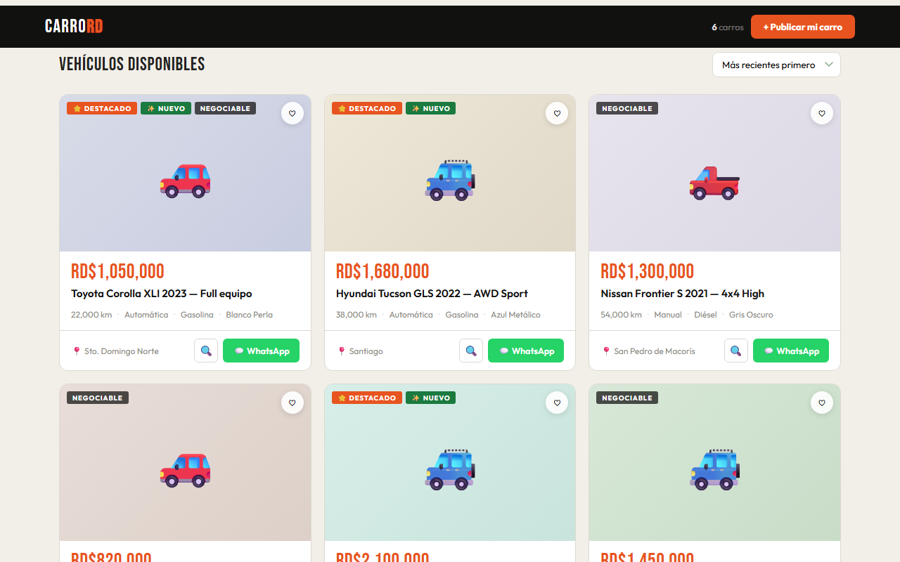
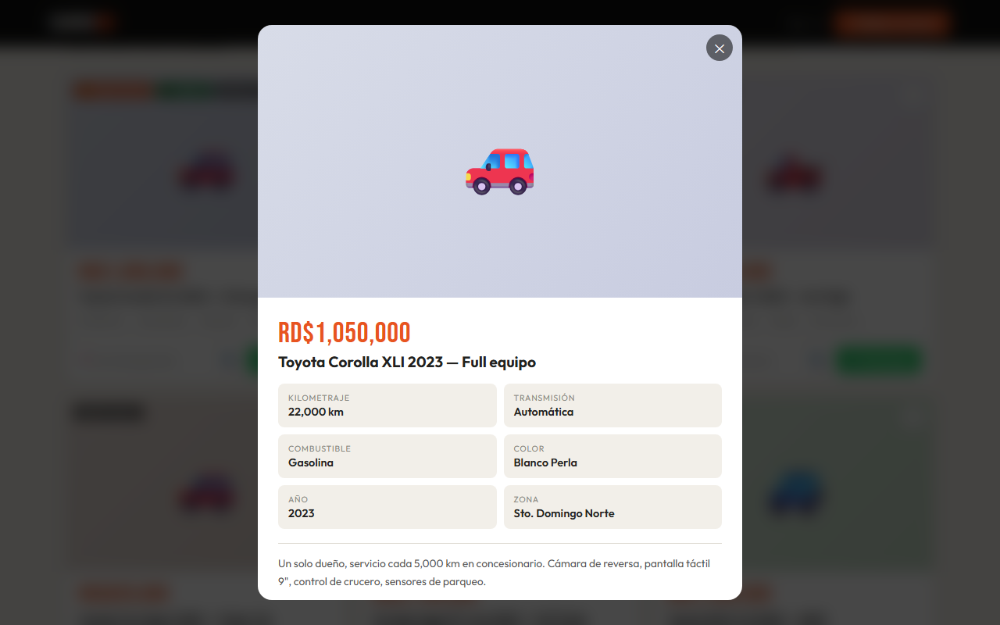
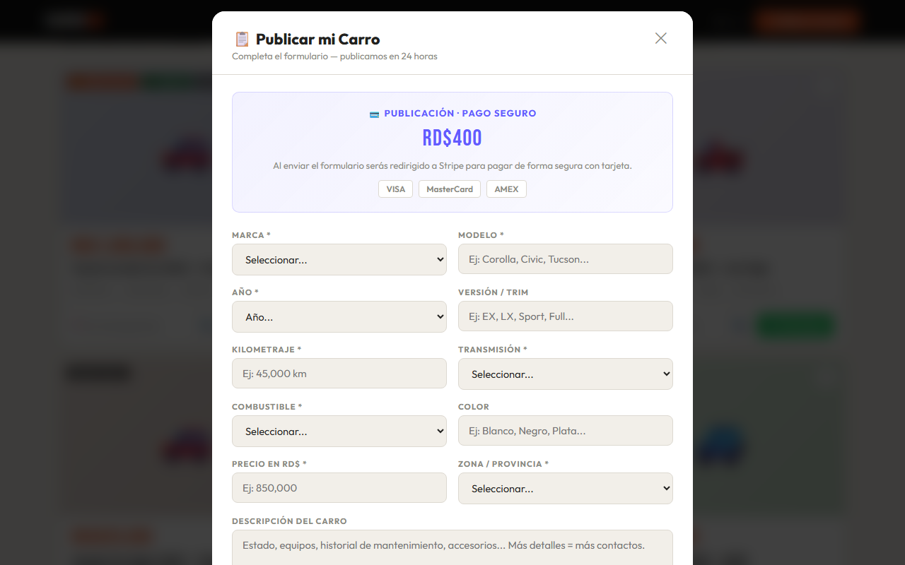
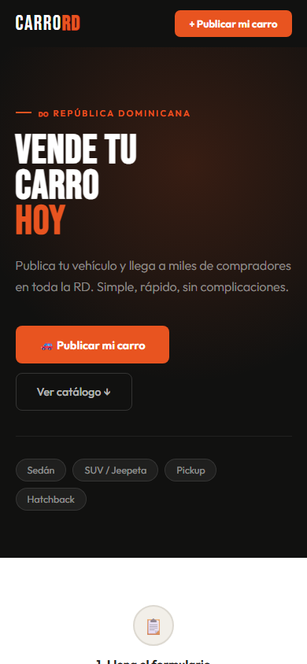

# CarroRD 🇩🇴

> Plataforma para publicar y vender vehículos en República Dominicana — simple, rápida y sin complicaciones.



---

## Vista general

### Catálogo de vehículos
Filtros rápidos por tipo, búsqueda en tiempo real, ordenamiento por precio y año.



### Modal de detalle
Información completa del vehículo con botón directo a WhatsApp y llamada.



### Formulario de publicación
El vendedor llena los datos, sube fotos y paga con Stripe en un solo flujo.



### Vista móvil
Diseño completamente responsivo optimizado para celular.



---

## Características

- **Catálogo** con filtros por tipo, precio, año, transmisión, combustible y zona
- **Búsqueda en tiempo real** con chips de filtros activos
- **Fotos** via Cloudinary (hasta 10 fotos por publicación)
- **Publicación con pago** integrado a Stripe
- **Base de datos** en Airtable — sin backend propio
- **Modo demo** — funciona sin configurar nada, con datos de ejemplo
- Responsive, optimizado para móvil

---

## Estructura del proyecto

```
CarroRD/
├── index.html              # HTML principal
├── css/
│   └── style.css           # Todos los estilos
├── js/
│   └── main.js             # Lógica (filtros, Airtable, Stripe, Cloudinary)
├── img/
│   ├── favicon.svg         # Ícono del sitio
│   └── og-image.svg        # Imagen para redes sociales
├── screenshots/            # Capturas de pantalla del sitio
├── .gitignore
└── README.md
```

---

## Configuración

Edita el objeto `CONFIG` al inicio de `index.html`:

```js
const CONFIG = {
  whatsapp:            '18095550000',       // Tu número (sin + ni espacios)
  precio:              'RD$400',            // Precio de publicación
  nombre:              'CarroRD',           // Nombre del sitio
  airtable_token:      'TU_TOKEN_AQUI',     // Token de Airtable
  airtable_base:       'TU_BASE_ID_AQUI',   // ID de la base
  airtable_table:      'Listings',          // Nombre de la tabla
  cloudinary_cloud:    'TU_CLOUD_NAME',     // Cloud name de Cloudinary
  cloudinary_preset:   'TU_UPLOAD_PRESET',  // Upload preset (unsigned)
  stripe_payment_link: 'TU_PAYMENT_LINK',   // URL del Payment Link de Stripe
};
```

### Paso 1 — Airtable (base de datos)

1. Crea una cuenta en [airtable.com](https://airtable.com)
2. Crea una base **CarroRD** con una tabla **Listings**
3. Agrega estas columnas:

| Columna    | Tipo              |
|------------|-------------------|
| Marca      | Single line text  |
| Modelo     | Single line text  |
| Anio       | Single line text  |
| Version    | Single line text  |
| Precio     | Single line text  |
| PrecioNum  | Number            |
| Km         | Single line text  |
| Trans      | Single line text  |
| Fuel       | Single line text  |
| Color      | Single line text  |
| Zona       | Single line text  |
| Desc       | Long text         |
| Nombre     | Single line text  |
| WA         | Single line text  |
| Neg        | Single line text  |
| Tipo       | Single line text  |
| Foto       | Attachment        |
| Status     | Single select     |
| Destacado  | Checkbox          |

4. Genera tu token en [airtable.com/create/tokens](https://airtable.com/create/tokens) con permisos `data.records:read` y `data.records:write`
5. Copia el **Base ID** desde la URL (empieza con `app...`)

### Paso 2 — Cloudinary (fotos)

1. Crea una cuenta en [cloudinary.com](https://cloudinary.com)
2. Copia tu **Cloud Name** desde el Dashboard
3. Ve a **Settings → Upload → Upload Presets** y crea un preset:
   - Signing Mode: **Unsigned**
   - Folder: `carrord`
4. Copia el nombre del preset

### Paso 3 — Stripe (cobros)

1. Crea una cuenta en [stripe.com](https://stripe.com)
2. Crea un producto **"Publicación CarroRD"** con precio RD$400 (pago único)
3. Genera un **Payment Link** y configura el redirect a `tu-url.com?pago=exitoso`
4. Copia la URL del Payment Link

### Flujo de aprobación

```
Usuario publica → Status = "Pendiente Pago"
Stripe cobra    → Usuario regresa al sitio
Tú apruebas    → Cambias Status a "Publicado" en Airtable
                  (o automatiza con un Webhook de Stripe)
```

---

## Correr localmente

```bash
python -m http.server 1000
# Abre: http://localhost:1000
```

---

## Deploy gratuito

**Netlify Drop** — arrastra la carpeta en [app.netlify.com/drop](https://app.netlify.com/drop) y obtienes una URL pública en segundos.

---

Desarrollado por [Fer1211](https://github.com/Fer1211) · República Dominicana 🇩🇴
